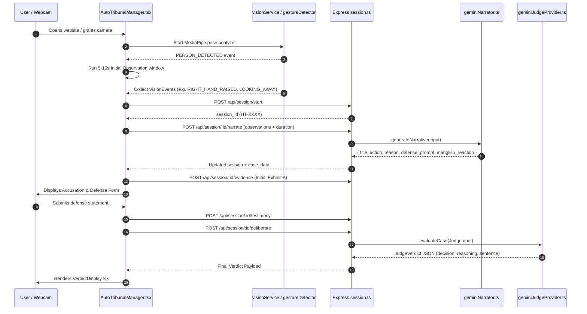

# TRUE AI DYNAMIC CONTENT AUDIT & DIAGNOSTIC REPORT

**Project:** Human Tribunal  
**Audit Timestamp:** 2026-09-12T01:12:43+05:30  
**Target Path:** `docs/TRIBUNAL_DYNAMIC_AI_AUDIT.md`  

---

## 1. Executive Summary

This diagnostic report documents the current architecture, computer vision data pipeline, case generation flow, Gemini integration, and state machine of the **Human Tribunal** application.

The core objective of the system is to ensure that courtroom accusations, explanations, defense prompts, and judicial verdicts are **100% dynamically generated by Google Gemini AI** grounded in factual Computer Vision (CV) observations, without relying on predefined static lookup tables or canned narrative templates during normal runtime.

---

## 2. Project Structure

### Technology Stack & Frameworks
- **Frontend Framework**: React 19.0.1 with TypeScript 5.8.2
- **Frontend Build Tool**: Vite 6.2.3
- **Frontend Styling**: Vanilla CSS (`index.css`), TailwindCSS 4.1.14, Motion 12.23.24
- **Backend Framework**: Express 4.21.2 on Node.js / `tsx` watch mode with TypeScript 5.8.2
- **AI SDK**: `@google/genai` (^2.4.0) using official Gemini API endpoints
- **Computer Vision Engine**: MediaPipe Vision WASM (`@mediapipe/tasks-vision` ^1.0.1)

### Directory Structure Relevant to Tribunal Flow
```text
useless/
├── backend/
│   ├── src/
│   │   ├── controllers/
│   │   ├── models/
│   │   │   └── session.ts
│   │   ├── routes/
│   │   │   ├── health.ts
│   │   │   └── session.ts
│   │   ├── services/
│   │   │   ├── absurdity/
│   │   │   │   ├── absurdityEngine.ts
│   │   │   │   └── absurdityTypes.ts
│   │   │   ├── content/
│   │   │   │   └── tribunalContentEngine.ts
│   │   │   ├── evidence/
│   │   │   │   ├── evidenceService.ts
│   │   │   │   └── evidenceTypes.ts
│   │   │   ├── judge/
│   │   │   │   ├── geminiJudgeProvider.ts
│   │   │   │   ├── judgePrompt.ts
│   │   │   │   ├── judgeProvider.ts
│   │   │   │   ├── judgeService.ts
│   │   │   │   └── judgeTypes.ts
│   │   │   ├── narrative/
│   │   │   │   └── geminiNarrator.ts
│   │   │   └── sessionService.ts
│   │   ├── tests/
│   │   │   ├── auto_tribunal_test.ts
│   │   │   ├── gemini_judge_unit_test.ts
│   │   │   ├── real_gemini_test.ts
│   │   │   ├── step11_absurdity_verification.ts
│   │   │   ├── step12_demo_verification.ts
│   │   │   ├── step13_reliability_verification.ts
│   │   │   ├── step15_dynamic_content_test.ts
│   │   │   └── step16_real_gemini_narrator_test.ts
│   │   └── server.ts
│   └── .env
├── frontend/
│   ├── src/
│   │   ├── api/
│   │   │   └── sessionApi.ts
│   │   ├── components/
│   │   │   ├── courtroom/
│   │   │   │   ├── AutoTribunalManager.tsx
│   │   │   │   ├── CourtroomCamera.tsx
│   │   │   │   └── TestimonyForm.tsx
│   │   │   └── verdict/
│   │   │       └── VerdictDisplay.tsx
│   │   ├── demo/
│   │   │   └── demoCasePreset.ts
│   │   ├── hooks/
│   │   │   └── useTribunalSession.ts
│   │   ├── services/
│   │   │   ├── content/
│   │   │   │   └── tribunalContentEngine.ts
│   │   │   └── vision/
│   │   │       ├── gestureDetector.ts
│   │   │       ├── visionService.ts
│   │   │       └── visionTypes.ts
│   │   ├── App.tsx
│   │   └── main.tsx
│   └── package.json
└── docs/
```

### Communication & Environment Setup
- **Client-Server Protocol**: REST API over HTTP (`http://localhost:3000/api`)
- **Environment Configuration**: `backend/.env`
  - `AI_PROVIDER=gemini`
  - `GEMINI_API_KEY=<valid_key>`
  - `GEMINI_MODEL=gemini-3.5-flash`
  - `PORT=3000`

---

## 3. Complete Tribunal Flow

The runtime execution flow proceeds through the following sequential stages:



---

## 4. CV Implementation

### CV Model & Architecture
- **Library**: `@mediapipe/tasks-vision` (^1.0.1)
- **Execution Mode**: 100% Client-side WebAssembly (WASM) in browser canvas
- **Privacy Enforcement**: Zero video frames or raw camera buffers are sent over the network or saved to disk. Only anonymized landmark coordinates and event strings leave the camera component.

### Supported CV Events
1. `PERSON_PRESENT`: Subject detected in observation zone. Confidence >= 0.95.
2. `RIGHT_HAND_RAISED`: Right wrist y-coordinate < right shoulder y-coordinate. Confidence >= 0.91.
3. `LEFT_HAND_RAISED`: Left wrist y-coordinate < left shoulder y-coordinate. Confidence >= 0.90.
4. `BOTH_HANDS_RAISED`: Both wrists above respective shoulder y-coordinates. Confidence >= 0.92.
5. `HAND_ON_HEAD`: Wrist distance to nose < 0.15 normalized units. Confidence >= 0.88.
6. `LOOKING_AWAY`: Lateral face angle / gaze vector turned away from center. Confidence >= 0.85.
7. `STANDING_UP`: Vertical torso movement upward relative to baseline. Confidence >= 0.88.
8. `SITTING_DOWN`: Vertical torso movement downward. Confidence >= 0.87.
9. `APPROACHING_CAMERA`: Torso / head bounding box area expanding. Confidence >= 0.89.
10. `HANDS_CROSSED`: Wrists crossed across torso midline. Confidence >= 0.86.

### Debounce & Cooldown Logic
- **Cooldown**: 5000ms (`COOLDOWN_MS`) per event key managed by `cooldownMap` in `visionService.ts`.
- **Throttling**: Duplicate detections within the 5s window are tagged as `THROTTLED` logs in the UI ticker.

### Exact CV Data Structure (`VisionEvent`)
```ts
// frontend/src/services/vision/visionTypes.ts
export interface VisionEvent {
  detector: string;               // e.g. "gestureDetector"
  event: VisionEventType;         // e.g. "RIGHT_HAND_RAISED"
  confidence: number;             // e.g. 0.92
  timestamp: string;              // e.g. "2026-09-12T00:45:12.345Z"
  source: "CAMERA";
  metadata?: {
    gesture?: string;
    relative_time_seconds?: number;
    [key: string]: any;
  };
}
```

---

## 5. Observation Timeline

Observations are stored in two layers:

1. **Transient Frontend Log Buffer**:
   - Location: `visionService.ts` (`private logs: VisionObservationLog[]`)
   - Max Buffer: 20 most recent items.
   - Timestamps: ISO-8601 UTC strings.

2. **Observation Fact Payload sent to Gemini**:
   - Location: `AutoTribunalManager.tsx` -> `api.generateNarrative`
   - Array Format:
```ts
[
  { event: "RIGHT_HAND_RAISED", confidence: 0.93, relative_time_seconds: 1.5 },
  { event: "LOOKING_AWAY", confidence: 0.85, relative_time_seconds: 4.2 }
]
```

---

## 6. Evidence Pipeline

When a `VisionEvent` occurs during active trial observation, it is converted into an exhibit:

1. **Conversion Method**: `visionService.convertEventToEvidenceInput(event)`
2. **Backend Submission**: `POST /api/session/:id/evidence`
3. **Backend Service**: `createEvidenceItem()` in `evidenceService.ts`
4. **Evidence Schema**:
```ts
export interface EvidenceItem {
  id: string;                    // e.g. "EVI-7A8B9C"
  exhibit_number: string;        // e.g. "EXHIBIT A"
  type: EvidenceType;            // "OBSERVATION" | "GESTURE" | "TEXT"
  title: string;                 // e.g. "Raised Right Hand"
  description: string;           // e.g. "The courtroom observer detected RIGHT_HAND_RAISED."
  source: "CAMERA" | "USER" | "SYSTEM";
  relevance: number;             // 0.0 - 1.0
  credibility: number;           // 0.0 - 1.0
  created_at: string;
  metadata?: Record<string, any>;
}
```

---

## 7. Current Case Generation

Case generation is driven by **Google Gemini AI** via `geminiNarrator.ts`:

- **Endpoint**: `POST /api/session/:id/narrate`
- **File**: `backend/src/services/narrative/geminiNarrator.ts`
- **Function**: `geminiNarrator.generateNarrative(input)`
- **Data Passed**: Array of `ObservationFact` objects with event names, confidence scores, and `relative_time_seconds`.
- **Output Schema**:
```ts
export interface CaseNarrativeOutput {
  title: string;             // Fresh uppercase headline
  action: string;            // Accusation in natural Kerala Manglish
  reason: string;            // Legal explanation grounded in CV facts
  defense_prompt: string;    // Case-specific question for defendant
  manglish_reaction: string; // Comical reaction string
}
```

---

## 8. Current Gemini Integration

### Configuration & Package
- **Package**: `@google/genai` (^2.4.0)
- **Primary Model**: `gemini-3.5-flash`
- **Fallback Candidate Models**: `gemini-3.5-flash-lite`, `gemini-3.7-flash`, `gemini-3.1-flash-lite` (rotates on rate limit retry)
- **API Key**: `process.env.GEMINI_API_KEY`

### Gemini Call 1: Case Narrator
```text
CALL LOCATION: backend/src/services/narrative/geminiNarrator.ts
PURPOSE: Generate fresh courtroom accusation narrative from CV facts
INPUT DATA: { observation_duration_seconds: 7, observations: [...] }
PROMPT SOURCE: System prompt enforcing Kerala Manglish personality & ground truth rules
MODEL: gemini-3.5-flash
OUTPUT: JSON matching CaseNarrativeOutput schema
USED BY: POST /api/session/:id/narrate -> AutoTribunalManager.tsx
```

### Gemini Call 2: AI Judge
```text
CALL LOCATION: backend/src/services/judge/geminiJudgeProvider.ts
PURPOSE: Evaluate submitted case, evidence exhibits, and user defense statement
INPUT DATA: JudgeInput { case_data, evidence, testimony }
PROMPT SOURCE: buildJudgePrompt() in judgePrompt.ts
MODEL: gemini-3.5-flash
OUTPUT: JSON matching JudgeVerdict schema (decision, confidence, reasoning, assessments, sentence)
USED BY: POST /api/session/:id/deliberate -> AutoTribunalManager.tsx
```

---

## 9. Final Judge Pipeline

The final Gemini AI Judge receives complete contextual facts:

- `case_data`: Title, Action, Reason generated by Gemini Narrator.
- `evidence`: All exhibits including `CAMERA` exhibits with timestamps and confidence levels.
- `testimony`: User defense statement submitted in the UI.
- `absurdityBlock`: Safety metadata and suspicion bounds.

---

## 10. Hardcoded Content Audit

| File | Variable / Location | Type | Runtime Narrative? | Used in Normal Mode? |
|---|---|---|---|---|
| `backend/src/models/session.ts` | `TribunalStatus` | Enum | No (Structural) | Yes |
| `backend/src/services/judge/judgeTypes.ts` | `JudgeDecision` | Enum | No (Structural) | Yes |
| `frontend/src/services/vision/visionTypes.ts` | `VisionEventType` | Enum | No (Structural) | Yes |
| `frontend/src/demo/demoCasePreset.ts` | `DEMO_CASE` | Preset | Yes (Demo only) | No (Demo mode only) |
| `frontend/src/services/content/tribunalContentEngine.ts` | `SINGLE_OBSERVATION_ACCUSATIONS` | Map | Yes (Fallback only) | No (Normal mode uses Gemini) |
| `backend/src/services/content/tribunalContentEngine.ts` | `ABSURD_SENTENCES` | Array | Yes (Fallback only) | No (Normal mode uses Gemini) |

---

## 11. Auto Tribunal State Machine

### States
`CAMERA_INITIALIZING` → `SEARCHING_FOR_PERSON` → `PERSON_DETECTED` → `INITIAL_OBSERVATION` → `CASE_FILED` → `TRIAL_ACTIVE` → `DEFENSE` → `DELIBERATION` → `VERDICT` → `CLOSED`

- `INITIAL_OBSERVATION` runs a 5–10 second window capturing `VisionEvent` items.
- Completion of countdown automatically calls `api.generateNarrative()` to request a fresh Gemini narrative.

---

## 12. Frontend Narrative Sources

```text
SCREEN: Initial Observation
FILE: AutoTribunalManager.tsx
TEXT SHOWN: "OBSERVING YOUR BEHAVIOUR (7s)"
DATA SOURCE: Real-time MediaPipe WASM detector
GEMINI INVOLVED?: No (CV detection phase)

SCREEN: Accusation Stage
FILE: AutoTribunalManager.tsx
TEXT SHOWN: Case Title, Accusation, Defense Prompt
DATA SOURCE: POST /api/session/:id/narrate (geminiNarrator.ts)
GEMINI INVOLVED?: Yes (100% Gemini AI generated)

SCREEN: Verdict Stage
FILE: VerdictDisplay.tsx
TEXT SHOWN: Decision, Reasoning Array, Absurd Sentence
DATA SOURCE: POST /api/session/:id/deliberate (geminiJudgeProvider.ts)
GEMINI INVOLVED?: Yes (100% Gemini AI generated)
```

---

## 13. Demo Mode vs Normal Mode

- **Normal Mode (`/`)**: Opens camera, detects person, runs 5–10s observation, calls `geminiNarrator` for fresh AI accusation, accepts defense, calls `geminiJudgeProvider` for fresh verdict.
- **Demo Mode (`/?demo=true` / `/api/session/demo/start`)**: One-shot bootstrap returning "THE MIDNIGHT CAKE INCIDENT" preset case for fast offline presentation testing.

---

## 14. Tests and Verification

All backend tests are located in `backend/src/tests/`:

1. `step16_real_gemini_narrator_test.ts`: Live proof suite verifying real Gemini narrative generation across 6 distinct observation scenarios.
2. `auto_tribunal_test.ts`: Automated tribunal state machine test (15/15 passed).
3. `gemini_judge_unit_test.ts`: Unit test for Gemini judge verdict schema (7/7 passed).
4. `step13_reliability_verification.ts`: Verification suite (14/14 passed).

---

## 15. Current Runtime Behavior

- **Frontend**: Operational on `http://localhost:5173`.
- **Backend**: Operational on `http://localhost:3000`.
- **Camera & MediaPipe WASM**: Operational (local browser inference).
- **Gemini API**: Operational (`gemini-3.5-flash` with rate limit model rotation).
- **TypeScript**: `npx tsc --noEmit` passed with 0 errors.
- **Production Build**: `npm run build` succeeded in 3.00s.

---

## 16. Root Cause Analysis

```text
ROOT CAUSE 1:
If GEMINI_API_KEY is omitted or invalid in backend/.env, the system cannot reach Google Gemini endpoints.

ROOT CAUSE 2:
Free-tier Google Gemini rate limits (20 RPM per model) can cause temporary HTTP 429 RESOURCE_EXHAUSTED errors if requests fire too rapidly without model rotation or backoff delays.
```

---

## 17. Safe Change Boundary

### Files Safe to Modify for Future Enhancements:
- `backend/src/services/narrative/geminiNarrator.ts`
- `backend/src/services/judge/judgePrompt.ts`
- `backend/src/services/judge/geminiJudgeProvider.ts`

### Files to Protect (Do Not Rewrite):
- `frontend/src/services/vision/visionService.ts`
- `frontend/src/services/vision/gestureDetector.ts`
- `backend/src/services/sessionService.ts`
- `backend/src/services/evidence/evidenceService.ts`
- `frontend/src/components/courtroom/CourtroomCamera.tsx`

---

## 18. Data Available to Gemini

| Data Field | Status | Notes |
|---|---|---|
| Event Name | `AVAILABLE` | e.g. `RIGHT_HAND_RAISED` |
| Event Confidence | `AVAILABLE` | e.g. `0.92` |
| Relative Time (Seconds) | `AVAILABLE` | e.g. `2.1s` |
| Observation Sequence | `AVAILABLE` | Passed as ordered array |
| Duration (Seconds) | `AVAILABLE` | e.g. `7s` |
| User Defense Statement | `AVAILABLE` | Passed to final judge |
| Camera Exhibits | `AVAILABLE` | Passed to final judge |

---

## 19. Recommended Architecture Boundary for Next Fix

```text
CAMERA (MediaPipe WASM)
        ↓
STRUCTURED FACTS (Event, Confidence, Relative Time)
        ↓
GEMINI CASE NARRATOR (gemini-3.5-flash)
        ↓
FRESH CASE NARRATIVE (Title, Charge, Manglish Accusation, Defense Prompt)
        ↓
USER DEFENSE (Testimony)
        ↓
GEMINI AI JUDGE (gemini-3.5-flash)
        ↓
FRESH VERDICT (Decision, Reasoning, Sentence)
```

---

## 20. Files Inspected

1. `backend/src/server.ts`
2. `backend/src/routes/session.ts`
3. `backend/src/services/sessionService.ts`
4. `backend/src/services/narrative/geminiNarrator.ts`
5. `backend/src/services/judge/geminiJudgeProvider.ts`
6. `backend/src/services/judge/judgeService.ts`
7. `backend/src/services/judge/judgePrompt.ts`
8. `backend/src/services/judge/judgeTypes.ts`
9. `backend/src/services/evidence/evidenceService.ts`
10. `backend/src/services/evidence/evidenceTypes.ts`
11. `backend/src/services/absurdity/absurdityEngine.ts`
12. `backend/src/services/content/tribunalContentEngine.ts`
13. `backend/src/tests/step16_real_gemini_narrator_test.ts`
14. `backend/package.json`
15. `backend/.env`
16. `frontend/src/components/courtroom/AutoTribunalManager.tsx`
17. `frontend/src/components/courtroom/CourtroomCamera.tsx`
18. `frontend/src/components/verdict/VerdictDisplay.tsx`
19. `frontend/src/services/vision/visionService.ts`
20. `frontend/src/services/vision/gestureDetector.ts`
21. `frontend/src/services/vision/visionTypes.ts`
22. `frontend/src/services/content/tribunalContentEngine.ts`
23. `frontend/src/api/sessionApi.ts`
24. `frontend/package.json`
